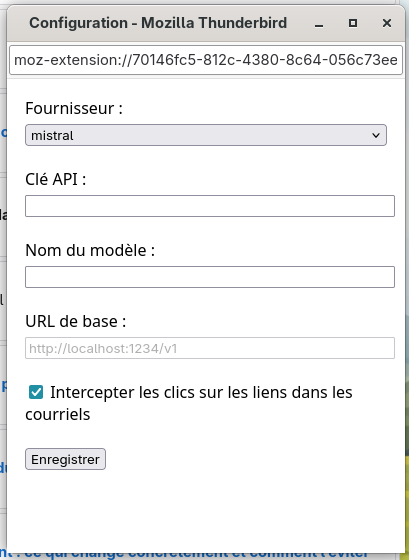
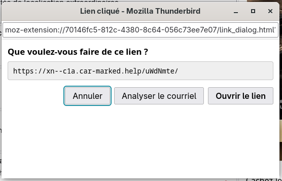

# Stop fraudulent email in Tunderbird

## What is it?

This plugin use a LLM to detect spam and frodulent email. It sends the complete
email source code to the LLM which provides an advise. To speed up process,
enclosed files are ignored.

The analysis can be triggered manually or when a link is clicked in the email.

## How to compile?

npm install
npm build run

## Load plugin in Thunderbird debug mode

Tools --> Developer Tools --> Debug Add-Ons

## Problem with Ollama

It can be necessary to define the Ollama CORS policy by setting the OLLAMA_ORIGINS variable.

OLLAMA_ORIGINS=chrome-extension://*,moz-extension://*,safari-web-extension://* ollama serve

(Source https://docs.ollama.com/faq)

